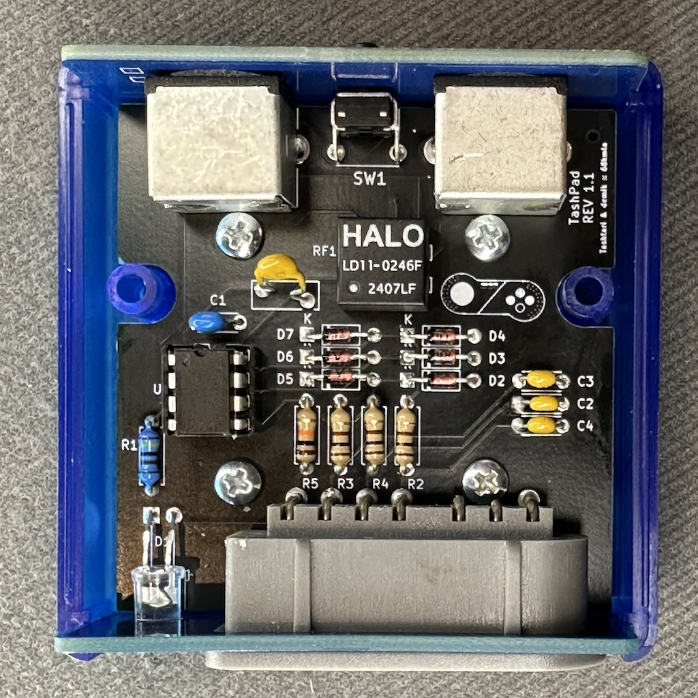

# TashPad

This is a simple PCB design, using all through hole components (with the exeption of the SD connector). It's designed this way to be period correct and easy to build for people who don't like soldering SMT components. Most of the components are only there for RF and short protection (inspired from both old Macs and the SNES itself)

This folder contains the source KiKad files for the main board. Please check the Panels subfolder for the FR-4 front and back plates.

## BOM
### Mandatory
Here is the BOM for the main board. Part number are what was tested on prototypes board but you may find alternatives easily, especially resistors and sockets

| Reference(s)          | Value      | Quantity | Notes                                  | Part number            |
|-----------------------|------------|----------|----------------------------------------|------------------------|
| C1                    | 100nF      | 1        | ceramic capacitor 5.08mm               | Weltron 453358         |
| C2, C3, C4            | 330pF      | 3        | ceramic capacitor 5.08mm               | Vishay K331K15X7RF5TH5 |
| D1                    | Green      | 1        | 5mm any color 20 mA LED                | Kingbright L-53SGD     |
| D2 to D7              | 1N4148     | 6        | general purpose switching diode        | Vishay 1N4148-TAP      |
| F1                    | 200mA Fuse | 1        | PPTC resettable fuse                   | Bourns MF-R020-2       |
| J1, J2                | Connector  | 2        | Mini DIN-4 (S-Video / ADB)             | TE 5749181-1           |
| J3                    | Connector  | 1        | SNES Angled (90°) connector            | ??? right gray one     |
| R2, R3, R4            | 100Ω       | 3        | standard 0.25W carbon film resistor    | TRU TC-CFR0W4J0101     |
| R1                    | 330Ω       | 1        | standard 0.25W carbon film resistor    | TRU TC-CFR0W4J0331     |
| R5                    | 10kΩ       | 1        | standard 0.25W carbon film resistor    | TRU TC-CFR0W4J0103     |
| SW1                   | SPST       | 1        | right angle SPST switch                | TE 118250277           |
| U1                    | PIC        | 1        | 8-bit Microcontrollers DIP PIC12F1501  | MC PIC12F1501-I/P      |
| Case                  | ABS        | 1        | Instrument Case, ABS 2.6x2.6"          | HM 1593K(TBU\|GY\|BK)  |
| PCB Screws            | #4         | 4        | Phillips Pan Head screws #4 x 1/4"     | 1593ATS50 (x50 !)      |

### Optional

| Reference(s)          | Value      | Quantity | Notes                                  | Part number            |
|-----------------------|------------|----------|----------------------------------------|------------------------|
| RF1                   | 1:1:1:1    | 1        | common mode chokes / filters           | HALO LD11-0246FLF      |
| R1                    | 2.2kΩ      | 1        | standard 0.25W carbon film resistor    | TRU CFR0W4J0222        |
| D1                    | Blue       | 1        | High efficiency 4000-8000mcd 5mm LED   | Kingbright WP7113VRCBC |

:information_source: The common choke is recommended but pricey (about $5). When building without one, you need to bridge the pads as shown on the PCB

R1 + D1 combo replaces the 300Ω + 20mA LED combo by an high efficiency LED which will be run with only 1mA. This put less load on the ADB bus and is the recommended choice

Using sockets is also recommended because it will allow you to reclaim the microcontroler if your board is broken. This will also allow you to upgrade the firmware if a future firmware is released.

## PCBs
the PCBs are simple 2 layers boards. The gerbers are avaible in the release section.
Check for the following files:
* TashPad_1.1.zip: main board revision 1.1
* TashPad_back_panel_1.1.zip: FR-4 back panel revision 1.1
* TashPad_front_panel_1.0.zip: FR-4 back panel revision 1.0

You should be use any mainstream PCB manufacturer for theses. Nothing special about them. PCB thickness should be 1.6mm

On JLCPCB, select "Specify a location" to the option "Remove Order Number" for all of them

## Building
Building is straightworfard. It's recommended to start with small components first (diodes, then resistor, LED), then other components, and connectors last.

:warning: Please note thay you need to solder the SNES connector with the front panel in position at the same time! Otherwise you will not be able to mount the front panel
